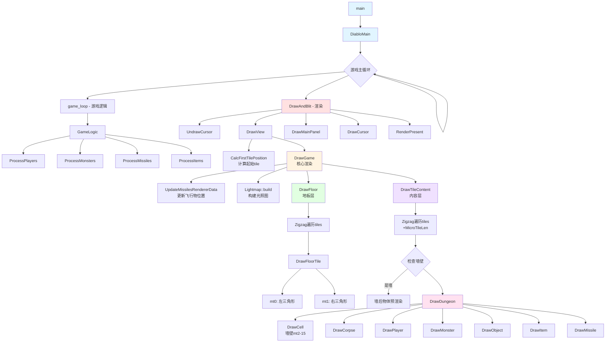
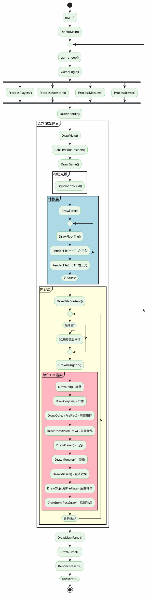
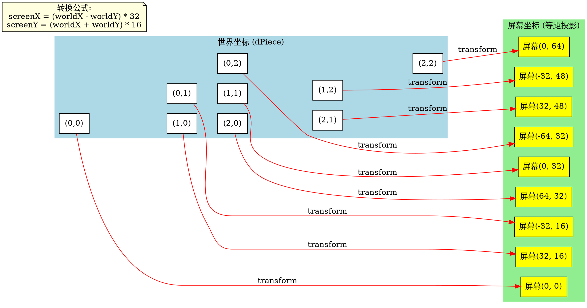
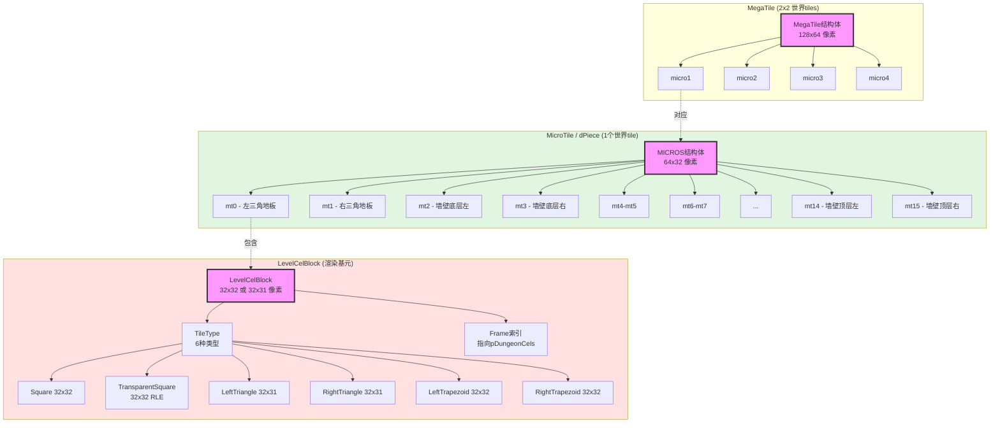
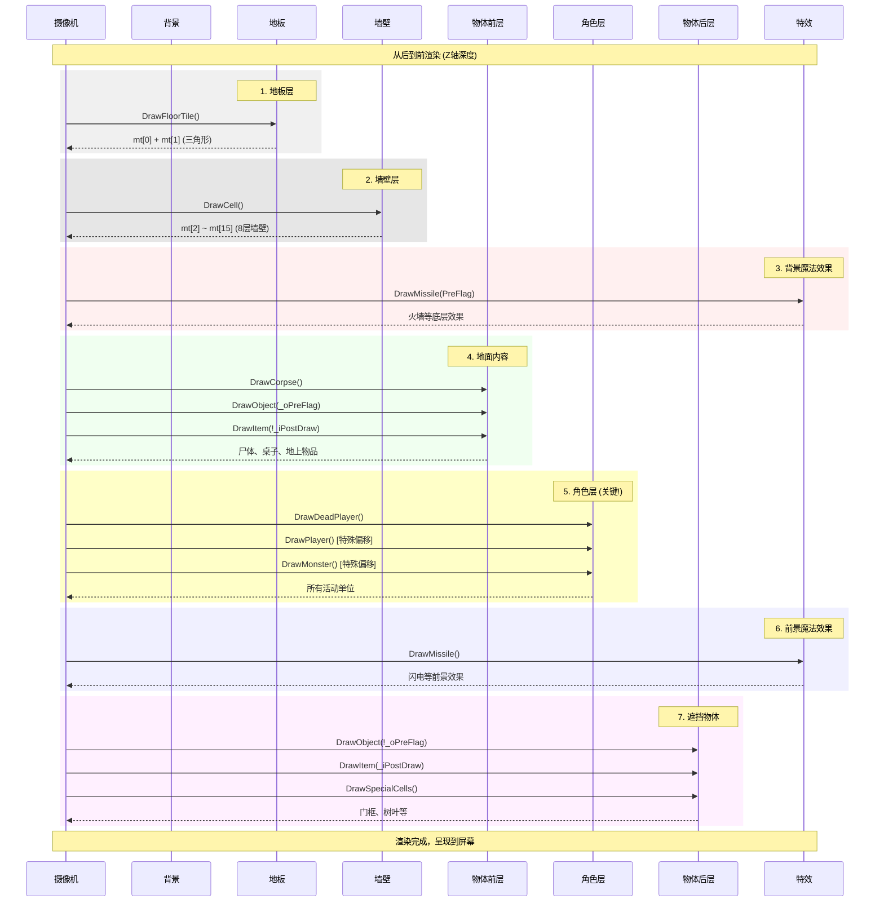
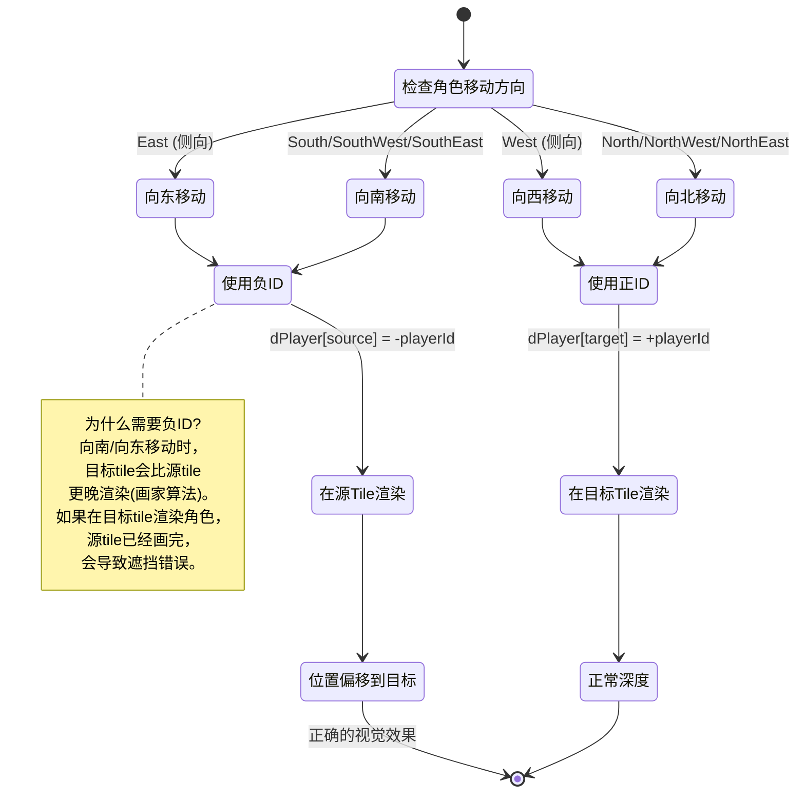
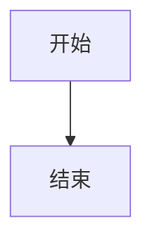

# DevilutionX 渲染流程可视化图表

本文档提供多种格式的可视化图表，帮助理解地牢渲染流程。

## 目录
1. [主渲染流程图（Mermaid）](#1-主渲染流程图)
2. [菱形网格遍历可视化](#2-菱形网格遍历可视化)
3. [MegaTile/MicroTile层次结构](#3-megatile-microtile层次结构)
4. [DrawDungeon渲染顺序](#4-drawdungeon渲染顺序)
5. [等距投影坐标转换](#5-等距投影坐标转换)
6. [移动角色的深度处理](#6-移动角色的深度处理)

---

## 1. 主渲染流程图

### Mermaid流程图（可在GitHub/GitLab/Typora中渲染）



### PlantUML流程图（可生成PNG/SVG）



---

## 2. 菱形网格遍历可视化

### 2.1 Zigzag遍历模式（SVG图）

保存为HTML文件可在浏览器中查看：

```html
<!DOCTYPE html>
<html>
<head>
<style>
  .tile { stroke: #333; stroke-width: 1; }
  .floor { fill: #8BC34A; }
  .wall { fill: #795548; }
  .order { font-size: 12px; font-weight: bold; fill: white; }
  .arrow { stroke: #F44336; stroke-width: 2; fill: none; marker-end: url(#arrowhead); }
</style>
</head>
<body>
<svg width="800" height="600" xmlns="http://www.w3.org/2000/svg">
  <defs>
    <marker id="arrowhead" markerWidth="10" markerHeight="10" refX="9" refY="3" orient="auto">
      <polygon points="0 0, 10 3, 0 6" fill="#F44336" />
    </marker>
  </defs>
  
  <!-- 标题 -->
  <text x="400" y="30" text-anchor="middle" font-size="24" font-weight="bold">
    Zigzag 菱形网格遍历
  </text>
  
  <!-- Row 0 (偶数行, 5个tile) -->
  <polygon class="tile floor" points="200,100 232,116 200,132 168,116" />
  <text class="order" x="195" y="120">1</text>
  
  <polygon class="tile floor" points="264,100 296,116 264,132 232,116" />
  <text class="order" x="259" y="120">2</text>
  
  <polygon class="tile floor" points="328,100 360,116 328,132 296,116" />
  <text class="order" x="323" y="120">3</text>
  
  <polygon class="tile floor" points="392,100 424,116 392,132 360,116" />
  <text class="order" x="387" y="120">4</text>
  
  <polygon class="tile floor" points="456,100 488,116 456,132 424,116" />
  <text class="order" x="451" y="120">5</text>
  
  <!-- 箭头 Row 0 -->
  <path class="arrow" d="M 232 116 L 259 116" />
  <path class="arrow" d="M 296 116 L 323 116" />
  <path class="arrow" d="M 360 116 L 387 116" />
  <path class="arrow" d="M 424 116 L 451 116" />
  
  <!-- Row 1 (奇数行, 4个tile, 向右偏移) -->
  <polygon class="tile floor" points="232,148 264,164 232,180 200,164" />
  <text class="order" x="227" y="168">6</text>
  
  <polygon class="tile floor" points="296,148 328,164 296,180 264,164" />
  <text class="order" x="291" y="168">7</text>
  
  <polygon class="tile floor" points="360,148 392,164 360,180 328,164" />
  <text class="order" x="355" y="168">8</text>
  
  <polygon class="tile floor" points="424,148 456,164 424,180 392,164" />
  <text class="order" x="419" y="168">9</text>
  
  <!-- 箭头 Row 1 -->
  <path class="arrow" d="M 264 164 L 291 164" />
  <path class="arrow" d="M 328 164 L 355 164" />
  <path class="arrow" d="M 392 164 L 419 164" />
  <path class="arrow" d="M 488 116 L 488 140 L 227 140 L 227 164" stroke-dasharray="5,5" />
  
  <!-- Row 2 (偶数行, 5个tile) -->
  <polygon class="tile floor" points="200,196 232,212 200,228 168,212" />
  <text class="order" x="194" y="216">10</text>
  
  <polygon class="tile floor" points="264,196 296,212 264,228 232,212" />
  <text class="order" x="258" y="216">11</text>
  
  <polygon class="tile floor" points="328,196 360,212 328,228 296,212" />
  <text class="order" x="322" y="216">12</text>
  
  <polygon class="tile floor" points="392,196 424,212 392,228 360,212" />
  <text class="order" x="386" y="216">13</text>
  
  <polygon class="tile floor" points="456,196 488,212 456,228 424,212" />
  <text class="order" x="450" y="216">14</text>
  
  <!-- 箭头 Row 2 -->
  <path class="arrow" d="M 456 180 L 456 190 L 194 190 L 194 212" stroke-dasharray="5,5" />
  <path class="arrow" d="M 232 212 L 258 212" />
  <path class="arrow" d="M 296 212 L 322 212" />
  <path class="arrow" d="M 360 212 L 386 212" />
  <path class="arrow" d="M 424 212 L 450 212" />
  
  <!-- 图例 -->
  <text x="100" y="300" font-size="16" font-weight="bold">特点：</text>
  <text x="100" y="325" font-size="14">• 偶数行(0,2): 5个tile, 向左对齐</text>
  <text x="100" y="345" font-size="14">• 奇数行(1,3): 4个tile, 向右偏移32px</text>
  <text x="100" y="365" font-size="14">• 每行下移16px (TILE_HEIGHT/2)</text>
  <text x="100" y="385" font-size="14">• columns在奇偶行之间+1/-1</text>
  
  <!-- 代码示意 -->
  <rect x="80" y="410" width="640" height="150" fill="#f5f5f5" stroke="#333" />
  <text x="100" y="435" font-family="monospace" font-size="12">for (int i = 0; i &lt; rows; i++) {</text>
  <text x="120" y="455" font-family="monospace" font-size="12">for (int j = 0; j &lt; columns; j++)</text>
  <text x="140" y="475" font-family="monospace" font-size="12">DrawTile(); // 向东移动</text>
  <text x="120" y="495" font-family="monospace" font-size="12">// 下一行</text>
  <text x="120" y="515" font-family="monospace" font-size="12">if (i & 1) { x++; columns--; screenX += 32; }</text>
  <text x="120" y="535" font-family="monospace" font-size="12">else       { y++; columns++; screenX -= 32; }</text>
  <text x="100" y="555" font-family="monospace" font-size="12">}</text>
</svg>
</body>
</html>
```

### 2.2 世界坐标与屏幕坐标对应（Graphviz DOT）



---

## 3. MegaTile / MicroTile 层次结构

### 3.1 三层层次结构图（Mermaid）



### 3.2 MicroTile的16层垂直布局（ASCII增强版）

```
┌────────────────────────────────────────────────────────────────┐
│                    MICROS 结构 (16个LevelCelBlock)              │
│                        64px × 256px (最大)                      │
└────────────────────────────────────────────────────────────────┘

  屏幕Y轴        左半(32px)      右半(32px)      用途/内容
    ↑           ┌─────────┐    ┌─────────┐
    │           │  mt[14] │    │  mt[15] │   ← 墙壁顶部装饰
-224px          └─────────┘    └─────────┘      (如塔尖、旗帜)
    │           
    │           ┌─────────┐    ┌─────────┐
    │           │  mt[12] │    │  mt[13] │   ← 墙壁上部
-192px          └─────────┘    └─────────┘
    │           
    │           ┌─────────┐    ┌─────────┐
    │           │  mt[10] │    │  mt[11] │   ← 墙壁中上部
-160px          └─────────┘    └─────────┘
    │           
    │           ┌─────────┐    ┌─────────┐
    │           │  mt[8]  │    │  mt[9]  │   ← 墙壁中部
-128px          └─────────┘    └─────────┘      (人物高度区域)
    │           
    │           ┌─────────┐    ┌─────────┐
    │           │  mt[6]  │    │  mt[7]  │   ← 墙壁中下部
 -96px          └─────────┘    └─────────┘
    │           
    │           ┌─────────┐    ┌─────────┐
    │           │  mt[4]  │    │  mt[5]  │   ← 墙壁下部
 -64px          └─────────┘    └─────────┘
    │           
    │           ┌─────────┐    ┌─────────┐
    │           │  mt[2]  │    │  mt[3]  │   ← 墙壁基座
 -32px          └─────────┘    └─────────┘
    │           
    │           ┌─────────┐    ┌─────────┐
    │           │◢ mt[0] │    │ mt[1] ◣│   ← 地板(三角形)
   0px          └─────────┘    └─────────┘      组成菱形
    │           
    └──────────────────────────────────────────────────

特殊说明:
• mt[0] = 左三角形 (31行, 2-32-2像素宽度渐变)
• mt[1] = 右三角形 (31行, 2-32-2像素宽度渐变)
• mt[2]~mt[15] = 成对渲染，每对形成64x32的横条
• 实际使用层数由MicroTileLen决定 (通常8层，即mt[0]~mt[15])
```

---

## 4. DrawDungeon渲染顺序

### 4.1 Z-Order分层图（Mermaid序列图）



### 4.2 渲染顺序详细表格

| 顺序 | 函数调用 | Z深度 | 说明 | 典型内容 |
|-----|---------|------|------|---------|
| 1 | `DrawCell()` | 最远 | 墙壁和地形结构 | 石墙、地板装饰 |
| 2 | `DrawMissile(PreFlag=true)` | 远 | 背景层魔法 | 火墙、毒云 |
| 3 | `DrawCorpse()` | 中远 | 躺在地上的尸体 | 死亡怪物 |
| 4 | `DrawObject(_oPreFlag=true)` | 中 | 地面物体 | 桌子、椅子、箱子 |
| 5 | `DrawItem(!_iPostDraw)` | 中 | 地面物品 | 装备、药水 |
| 6 | `DrawDeadPlayer()` | 中近 | 死亡玩家 | 骷髅 |
| 7 | `DrawPlayer()` | 近 | **活着的玩家** | **主角/队友** |
| 8 | `DrawMonster()` | 近 | 怪物 | 所有活着的敌人 |
| 9 | `DrawMissile(PreFlag=false)` | 很近 | 前景魔法 | 闪电、火球 |
| 10 | `DrawObject(!_oPreFlag)` | 最近 | 遮挡物体 | 门框、柱子 |
| 11 | `DrawItem(_iPostDraw)` | 最近 | 前置物品 | 悬挂的物品 |
| 12 | `DrawSpecialCells()` | 最近 | 特殊装饰 | 城镇树叶 |

---

## 5. 等距投影坐标转换

### 5.1 3D到2D转换图解（HTML+Canvas）

```html
<!DOCTYPE html>
<html>
<head>
<title>等距投影转换</title>
</head>
<body>
<canvas id="iso" width="800" height="600"></canvas>
<script>
const canvas = document.getElementById('iso');
const ctx = canvas.getContext('2d');

// 原点偏移
const offsetX = 400;
const offsetY = 100;

// 等距投影转换
function worldToScreen(wx, wy) {
    return {
        x: (wx - wy) * 32 + offsetX,
        y: (wx + wy) * 16 + offsetY
    };
}

// 绘制网格
ctx.strokeStyle = '#ccc';
ctx.lineWidth = 1;

for (let y = 0; y <= 5; y++) {
    for (let x = 0; x <= 5; x++) {
        const pos = worldToScreen(x, y);
        
        // 绘制菱形
        if (x < 5 && y < 5) {
            const p1 = worldToScreen(x, y);
            const p2 = worldToScreen(x + 1, y);
            const p3 = worldToScreen(x + 1, y + 1);
            const p4 = worldToScreen(x, y + 1);
            
            ctx.beginPath();
            ctx.moveTo(p1.x, p1.y);
            ctx.lineTo(p2.x, p2.y);
            ctx.lineTo(p3.x, p3.y);
            ctx.lineTo(p4.x, p4.y);
            ctx.closePath();
            ctx.fillStyle = (x + y) % 2 === 0 ? '#8BC34A' : '#7CB342';
            ctx.fill();
            ctx.stroke();
            
            // 标注坐标
            ctx.fillStyle = 'white';
            ctx.font = 'bold 12px Arial';
            ctx.textAlign = 'center';
            ctx.fillText(`(${x},${y})`, p1.x, p1.y + 20);
        }
    }
}

// 标题
ctx.fillStyle = 'black';
ctx.font = 'bold 24px Arial';
ctx.textAlign = 'center';
ctx.fillText('等距投影：世界坐标 → 屏幕坐标', 400, 30);

// 公式
ctx.font = '16px monospace';
ctx.fillStyle = '#333';
ctx.fillText('screenX = (worldX - worldY) * 32', 400, 500);
ctx.fillText('screenY = (worldX + worldY) * 16', 400, 520);

// 绘制坐标轴
ctx.strokeStyle = '#F44336';
ctx.lineWidth = 2;
ctx.beginPath();
ctx.moveTo(offsetX, offsetY);
ctx.lineTo(offsetX + 100, offsetY + 50);
ctx.stroke();
ctx.fillStyle = '#F44336';
ctx.fillText('X轴', offsetX + 110, offsetY + 55);

ctx.strokeStyle = '#2196F3';
ctx.beginPath();
ctx.moveTo(offsetX, offsetY);
ctx.lineTo(offsetX - 100, offsetY + 50);
ctx.stroke();
ctx.fillStyle = '#2196F3';
ctx.fillText('Y轴', offsetX - 110, offsetY + 55);
</script>
</body>
</html>
```

---

## 6. 移动角色的深度处理

### 6.1 负ID机制图解（Mermaid状态图）



### 6.2 移动偏移计算图（SVG）

```html
<!DOCTYPE html>
<html>
<body>
<svg width="900" height="700" xmlns="http://www.w3.org/2000/svg">
  <!-- 标题 -->
  <text x="450" y="40" text-anchor="middle" font-size="28" font-weight="bold">
    移动角色的屏幕位置偏移
  </text>
  
  <!-- 场景1: 向北移动 (正常) -->
  <g transform="translate(100, 100)">
    <text x="0" y="0" font-size="18" font-weight="bold">场景1: 向北移动 (正常)</text>
    
    <polygon points="100,80 132,96 100,112 68,96" fill="#90CAF9" stroke="#333" stroke-width="2"/>
    <text x="95" y="100" font-size="12">Tile A</text>
    <text x="85" y="115" font-size="10">(上方)</text>
    
    <polygon points="100,128 132,144 100,160 68,144" fill="#4CAF50" stroke="#333" stroke-width="2"/>
    <text x="95" y="148" font-size="12">Tile B</text>
    <text x="85" y="163" font-size="10">(下方)</text>
    
    <circle cx="100" cy="144" r="8" fill="#F44336"/>
    <text x="115" y="148" font-size="12">玩家</text>
    
    <text x="0" y="190" font-size="14" fill="green">✓ 正确: Tile B后渲染，玩家正确显示</text>
    <text x="0" y="210" font-size="12" font-family="monospace">dPlayer[B] = +playerId</text>
  </g>
  
  <!-- 场景2: 向南移动 (问题) -->
  <g transform="translate(450, 100)">
    <text x="0" y="0" font-size="18" font-weight="bold">场景2: 向南移动 (有问题)</text>
    
    <polygon points="100,80 132,96 100,112 68,96" fill="#4CAF50" stroke="#333" stroke-width="2"/>
    <text x="95" y="100" font-size="12">Tile A</text>
    <text x="80" y="115" font-size="10">(源tile)</text>
    
    <polygon points="100,128 132,144 100,160 68,144" fill="#90CAF9" stroke="#333" stroke-width="2"/>
    <text x="95" y="148" font-size="12">Tile B</text>
    <text x="75" y="163" font-size="10">(目标tile)</text>
    
    <circle cx="100" cy="144" r="8" fill="#F44336"/>
    <text x="115" y="148" font-size="12">玩家</text>
    
    <text x="0" y="190" font-size="14" fill="red">✗ 错误: 如果在B渲染，A已画完</text>
    <text x="0" y="210" font-size="12" fill="red">玩家可能被A的墙壁错误遮挡</text>
  </g>
  
  <!-- 场景3: 向南移动 (解决方案) -->
  <g transform="translate(100, 380)">
    <text x="0" y="0" font-size="18" font-weight="bold">场景3: 向南移动 (负ID解决)</text>
    
    <polygon points="100,80 132,96 100,112 68,96" fill="#4CAF50" stroke="#333" stroke-width="2"/>
    <text x="95" y="100" font-size="12">Tile A</text>
    
    <polygon points="100,128 132,144 100,160 68,144" fill="#90CAF9" stroke="#333" stroke-width="2"/>
    <text x="95" y="148" font-size="12">Tile B</text>
    
    <!-- 虚线表示偏移 -->
    <line x1="100" y1="96" x2="100" y2="144" stroke="#FF9800" stroke-width="2" stroke-dasharray="5,5"/>
    <text x="110" y="120" font-size="10" fill="#FF9800">偏移</text>
    
    <circle cx="100" cy="144" r="8" fill="#F44336"/>
    <text x="115" y="148" font-size="12">玩家</text>
    
    <text x="0" y="190" font-size="14" fill="green">✓ 解决: 在A渲染，位置偏移到B</text>
    <text x="0" y="210" font-size="12" font-family="monospace">dPlayer[A] = -playerId</text>
    <text x="0" y="230" font-size="12" font-family="monospace">offset += {0, -TILE_HEIGHT}</text>
  </g>
  
  <!-- 偏移量表格 -->
  <g transform="translate(450, 380)">
    <text x="0" y="0" font-size="18" font-weight="bold">各方向偏移量</text>
    
    <rect x="0" y="10" width="350" height="240" fill="none" stroke="#333" stroke-width="2"/>
    
    <!-- 表头 -->
    <rect x="0" y="10" width="150" height="40" fill="#E3F2FD" stroke="#333"/>
    <rect x="150" y="10" width="200" height="40" fill="#E3F2FD" stroke="#333"/>
    <text x="75" y="35" text-anchor="middle" font-weight="bold">方向</text>
    <text x="250" y="35" text-anchor="middle" font-weight="bold">屏幕偏移</text>
    
    <!-- 数据行 -->
    <rect x="0" y="50" width="150" height="40" fill="white" stroke="#333"/>
    <rect x="150" y="50" width="200" height="40" fill="white" stroke="#333"/>
    <text x="10" y="75" font-family="monospace">SouthWest</text>
    <text x="160" y="75" font-family="monospace">{+32, -16}</text>
    
    <rect x="0" y="90" width="150" height="40" fill="white" stroke="#333"/>
    <rect x="150" y="90" width="200" height="40" fill="white" stroke="#333"/>
    <text x="10" y="115" font-family="monospace">South</text>
    <text x="160" y="115" font-family="monospace">{0, -32}</text>
    
    <rect x="0" y="130" width="150" height="40" fill="white" stroke="#333"/>
    <rect x="150" y="130" width="200" height="40" fill="white" stroke="#333"/>
    <text x="10" y="155" font-family="monospace">SouthEast</text>
    <text x="160" y="155" font-family="monospace">{-32, -16}</text>
    
    <rect x="0" y="170" width="150" height="40" fill="white" stroke="#333"/>
    <rect x="150" y="170" width="200" height="40" fill="white" stroke="#333"/>
    <text x="10" y="195" font-family="monospace">East (侧向)</text>
    <text x="160" y="195" font-family="monospace">{-64, 0}</text>
    
    <rect x="0" y="210" width="350" height="40" fill="#FFF9C4" stroke="#333"/>
    <text x="10" y="235" font-size="12">公式: tempTilePosition += Opposite(dir)</text>
  </g>
</svg>
</body>
</html>
```

---

## 7. 使用建议

### 7.1 在Markdown中嵌入Mermaid
大多数现代Markdown编辑器（Typora、VS Code、GitHub）都支持Mermaid：

````markdown

````

### 7.2 生成SVG/PNG图片
使用在线工具：
- **Mermaid Live Editor**: https://mermaid.live/
- **PlantUML Online**: http://www.plantuml.com/plantuml/
- **Graphviz Online**: https://dreampuf.github.io/GraphvizOnline/

### 7.3 在文档工具中使用
- **Notion**: 支持代码块渲染Mermaid
- **Confluence**: 需要插件支持
- **GitBook**: 原生支持Mermaid
- **Docusaurus**: 通过插件支持

### 7.4 导出高质量图片
```bash
# 使用mermaid-cli
npm install -g @mermaid-js/mermaid-cli
mmdc -i input.mmd -o output.png -w 1920 -H 1080

# 使用plantuml
java -jar plantuml.jar diagram.puml
```

---

## 8. 交互式示例

保存以下代码为HTML文件，可在浏览器中交互查看：

```html
<!DOCTYPE html>
<html>
<head>
<title>DevilutionX渲染流程交互演示</title>
<style>
body { font-family: Arial, sans-serif; margin: 20px; background: #f5f5f5; }
.container { max-width: 1200px; margin: 0 auto; background: white; padding: 20px; border-radius: 8px; }
h1 { color: #d32f2f; }
.controls { margin: 20px 0; }
button { padding: 10px 20px; margin: 5px; cursor: pointer; background: #2196F3; color: white; border: none; border-radius: 4px; }
button:hover { background: #1976D2; }
canvas { border: 2px solid #333; display: block; margin: 20px auto; background: #fff; }
.info { background: #E3F2FD; padding: 15px; margin: 10px 0; border-left: 4px solid #2196F3; }
</style>
</head>
<body>
<div class="container">
  <h1>🎮 DevilutionX 渲染流程可视化</h1>
  
  <div class="controls">
    <button onclick="showZigzag()">显示Zigzag遍历</button>
    <button onclick="showMicroTile()">显示MicroTile结构</button>
    <button onclick="showDepthOrder()">显示深度排序</button>
    <button onclick="animateRender()">动画演示渲染</button>
  </div>
  
  <canvas id="demo" width="800" height="600"></canvas>
  
  <div class="info">
    <strong>当前显示:</strong> <span id="currentView">点击按钮查看不同的可视化</span>
  </div>
</div>

<script>
const canvas = document.getElementById('demo');
const ctx = canvas.getContext('2d');
const info = document.getElementById('currentView');

function clear() {
  ctx.clearRect(0, 0, canvas.width, canvas.height);
}

function showZigzag() {
  clear();
  info.textContent = 'Zigzag菱形网格遍历模式';
  
  let order = 1;
  const startX = 200, startY = 100;
  
  // 绘制5行zigzag
  for (let row = 0; row < 5; row++) {
    const cols = row % 2 === 0 ? 5 : 4;
    const offsetX = row % 2 === 0 ? 0 : 32;
    
    for (let col = 0; col < cols; col++) {
      const x = startX + offsetX + col * 64;
      const y = startY + row * 48;
      
      // 绘制菱形
      ctx.beginPath();
      ctx.moveTo(x, y);
      ctx.lineTo(x + 32, y + 16);
      ctx.lineTo(x, y + 32);
      ctx.lineTo(x - 32, y + 16);
      ctx.closePath();
      
      ctx.fillStyle = row % 2 === 0 ? '#8BC34A' : '#7CB342';
      ctx.fill();
      ctx.strokeStyle = '#333';
      ctx.lineWidth = 2;
      ctx.stroke();
      
      // 绘制顺序号
      ctx.fillStyle = 'white';
      ctx.font = 'bold 16px Arial';
      ctx.textAlign = 'center';
      ctx.fillText(order++, x, y + 20);
    }
  }
}

function showMicroTile() {
  clear();
  info.textContent = 'MicroTile的16层垂直结构';
  
  const x = 400, baseY = 550;
  
  // 绘制16层
  for (let i = 0; i < 8; i++) {
    const y = baseY - i * 32;
    const colors = ['#FFEB3B', '#FFC107', '#FF9800', '#FF5722', 
                    '#F44336', '#E91E63', '#9C27B0', '#673AB7'];
    
    // 左半部分 mt[i*2]
    ctx.fillStyle = colors[i];
    ctx.fillRect(x - 64, y - 32, 32, 32);
    ctx.strokeStyle = '#333';
    ctx.strokeRect(x - 64, y - 32, 32, 32);
    ctx.fillStyle = 'white';
    ctx.font = '10px monospace';
    ctx.textAlign = 'center';
    ctx.fillText(`mt[${i * 2}]`, x - 48, y - 12);
    
    // 右半部分 mt[i*2+1]
    ctx.fillStyle = colors[i];
    ctx.fillRect(x - 32, y - 32, 32, 32);
    ctx.strokeRect(x - 32, y - 32, 32, 32);
    ctx.fillText(`mt[${i * 2 + 1}]`, x - 16, y - 12);
  }
  
  // 标注
  ctx.fillStyle = '#333';
  ctx.font = '14px Arial';
  ctx.textAlign = 'left';
  ctx.fillText('地板 (mt[0],mt[1])', x + 10, baseY - 10);
  ctx.fillText('墙壁底部', x + 10, baseY - 64);
  ctx.fillText('墙壁中部', x + 10, baseY - 128);
  ctx.fillText('墙壁顶部', x + 10, baseY - 224);
}

function showDepthOrder() {
  clear();
  info.textContent = 'DrawDungeon的Z-Order渲染顺序';
  
  const layers = [
    {name: '1. DrawCell (墙壁)', color: '#795548'},
    {name: '2. DrawMissile (背景)', color: '#FF5722'},
    {name: '3. DrawCorpse', color: '#9E9E9E'},
    {name: '4. DrawObject (前)', color: '#8D6E63'},
    {name: '5. DrawItem (前)', color: '#FFC107'},
    {name: '6. DrawPlayer', color: '#2196F3'},
    {name: '7. DrawMonster', color: '#F44336'},
    {name: '8. DrawMissile (前)', color: '#FF9800'},
    {name: '9. DrawObject (后)', color: '#6D4C41'},
    {name: '10. DrawItem (后)', color: '#FFD54F'}
  ];
  
  const startY = 50;
  layers.forEach((layer, i) => {
    const y = startY + i * 50;
    
    // 绘制层
    ctx.fillStyle = layer.color;
    ctx.fillRect(50, y, 700, 40);
    ctx.strokeStyle = '#333';
    ctx.strokeRect(50, y, 700, 40);
    
    // 文字
    ctx.fillStyle = 'white';
    ctx.font = 'bold 16px Arial';
    ctx.textAlign = 'left';
    ctx.fillText(layer.name, 60, y + 25);
  });
  
  // 箭头表示从后到前
  ctx.strokeStyle = '#F44336';
  ctx.lineWidth = 3;
  ctx.beginPath();
  ctx.moveTo(770, startY);
  ctx.lineTo(770, startY + 450);
  ctx.stroke();
  
  // 箭头头部
  ctx.beginPath();
  ctx.moveTo(770, startY + 450);
  ctx.lineTo(760, startY + 430);
  ctx.lineTo(780, startY + 430);
  ctx.closePath();
  ctx.fillStyle = '#F44336';
  ctx.fill();
  
  ctx.fillStyle = '#F44336';
  ctx.font = 'bold 14px Arial';
  ctx.textAlign = 'center';
  ctx.fillText('渲染方向', 770, startY + 480);
  ctx.fillText('(从后到前)', 770, startY + 500);
}

function animateRender() {
  clear();
  info.textContent = '动画演示：逐层渲染过程';
  
  let step = 0;
  const maxSteps = 10;
  
  const interval = setInterval(() => {
    if (step >= maxSteps) {
      clearInterval(interval);
      return;
    }
    
    const x = 400, y = 400;
    const layers = [
      {name: '地板', color: '#8BC34A', height: 10},
      {name: '墙壁', color: '#795548', height: 100},
      {name: '物体', color: '#8D6E63', height: 50},
      {name: '角色', color: '#2196F3', height: 60},
      {name: '特效', color: '#FF9800', height: 40}
    ];
    
    for (let i = 0; i <= Math.min(step, layers.length - 1); i++) {
      const layer = layers[i];
      const layerY = y - layers.slice(0, i).reduce((sum, l) => sum + l.height, 0);
      
      ctx.fillStyle = layer.color;
      ctx.fillRect(x - 50, layerY - layer.height, 100, layer.height);
      ctx.strokeStyle = '#333';
      ctx.strokeRect(x - 50, layerY - layer.height, 100, layer.height);
      
      ctx.fillStyle = 'white';
      ctx.font = 'bold 12px Arial';
      ctx.textAlign = 'center';
      ctx.fillText(layer.name, x, layerY - layer.height / 2 + 4);
    }
    
    step++;
  }, 500);
}

// 初始显示
showZigzag();
</script>
</body>
</html>
```

---

## 总结

本文档提供了多种可视化格式：

1. **Mermaid图表** - 可在Markdown中直接渲染
2. **PlantUML图表** - 生成高质量矢量图
3. **SVG/HTML** - 浏览器中可交互查看
4. **Graphviz DOT** - 专业的图形布局
5. **交互式Canvas演示** - 动态展示渲染过程

选择最适合您文档系统的格式使用！


